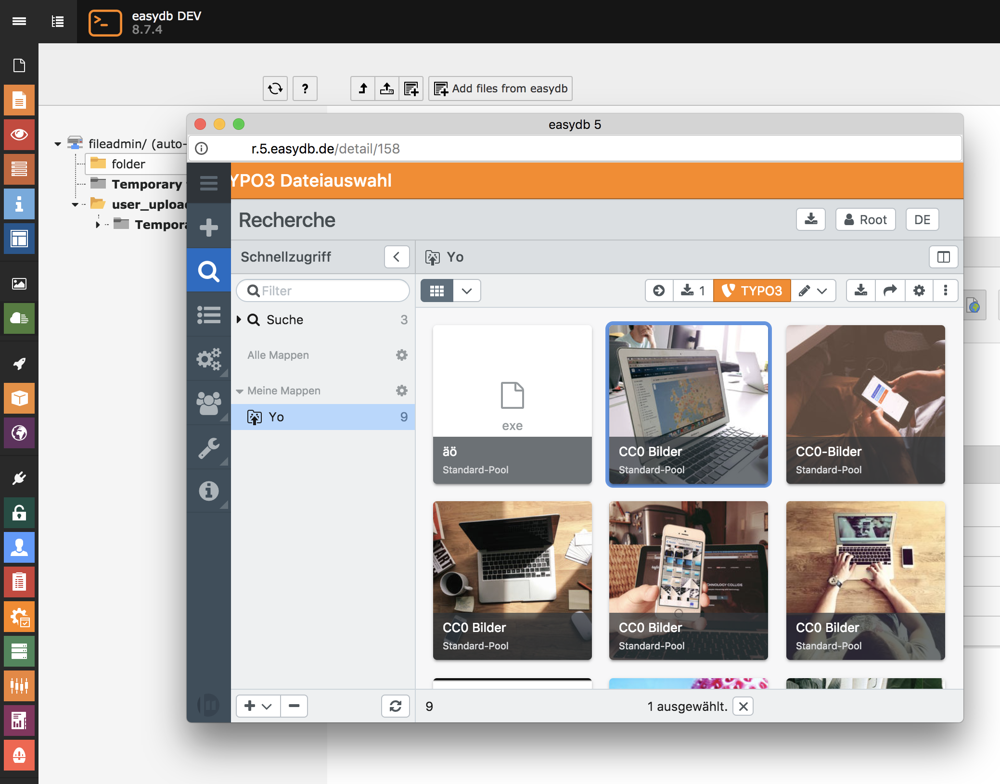

.. ==================================================
.. FOR YOUR INFORMATION
.. --------------------------------------------------
.. -*- coding: utf-8 -*- with BOM.

.. include:: ../Includes.txt

What does it do?
================

This extension allows users to import media files from easydb_ digital asset management system into a TYPO3 file storage.
It is compatible with all supported TYPO3 LTS versions (currently 7.6 and 8.7).

The to be imported files can be selected in a popup window, which shows the easydb file picker UI.
When pressing the import button, these files are copied into the TYPO3 storage.

When the same files are copied again, they are updated within TYPO3.

However when a file is deleted in easydb it will still remain within TYPO3 until is deleted there as well.

.. _easydb: https://www.programmfabrik.de/easydb/

	Selecting a file from easydb for import into TYPO3
