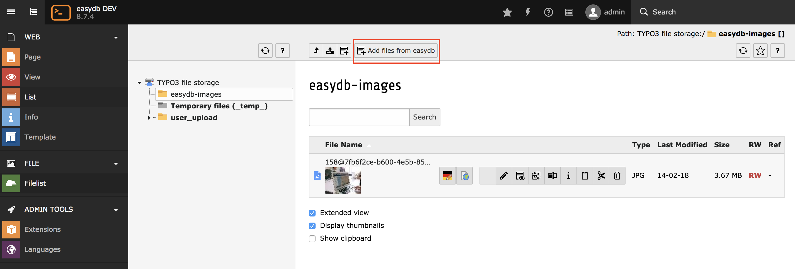
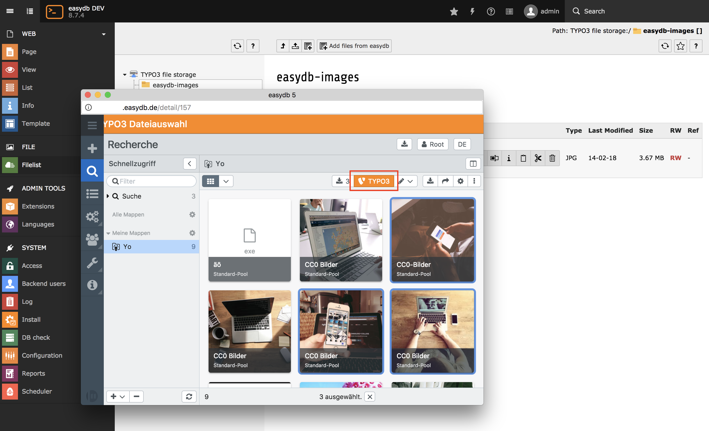

.. ==================================================
.. FOR YOUR INFORMATION
.. --------------------------------------------------
.. -*- coding: utf-8 -*- with BOM.

.. include:: ../Includes.txt

.. _users-manual:

Users manual
============

As an editor, importing files from easydb is straightforward.

The extension adds an additional button for adding files from easydb, which can be used as an alternative
to uploading files from a local computer.

Navigate the the filelist module within TYPO3, select a folder within the storage where the easydb files
should be imported into and press the "Add files from easydb" button.

	Button to import files

A file picker appears in a popup window appears, presenting the easydb UI.
You can use the search and filters to find the files you want to import.
Select files you want to import and after that press the TYPO3 import button.

	easydb file picker

After confirming the import, the selected files from easydb are imported into the TYPO3 file storage.

	successful import

Updating files within TYPO3
~~~~~~~~~~~~~~~~~~~~~~~~~~~

If files change in easydb, they are not automatically updated within TYPO3.
To update them, import the files in question again. The easydb TYPO3 extension detects
that files files were previously imported and updates them.

