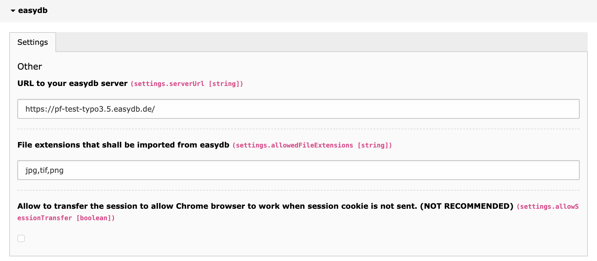
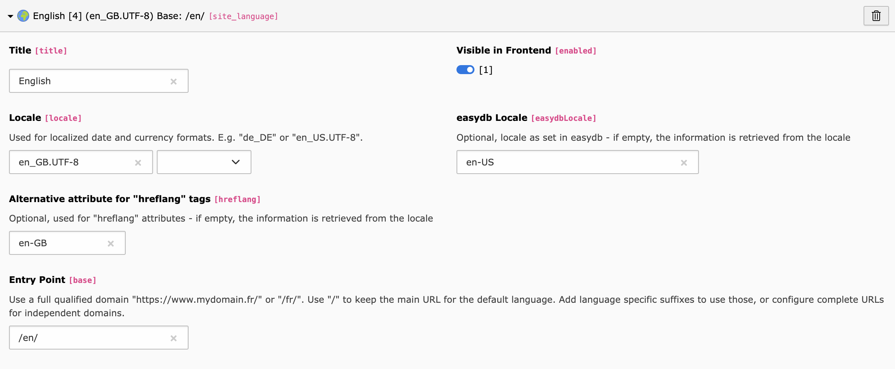

# TYPO3 [easydb](http://5.docs.easydb.de/docs/webfrontend/datamanagement/features/plugins/?node=4,4.1.3) integration

This TYPO3 extension provides an interface in the TYPO3 backend
to access and import files from easydb digital asset management.

## Installation

Either [download and install](https://typo3.org/extensions/repository/view/typo3_console) it from TER,
or install it with composer: `composer require easydb/typo3-integration`

## Configuration

You can configure the extension by using the Extension Manager backend module.
Just open the extension configuration of *easydb* extension and at least specify
a server URL to your easydb server.

You can limit the allowed file extensions of files that can be imported from easydb.

Just specify a comma separated list extensions.

If you don't need multi language support, you will be good to go. Otherwise read on.

### Multilanguage configuration

The only thing you need to do is set the easydb locale that should be mapped to the TYPO3 default
language in the extension manager configuration and set the according easydb locale in each TYPO3 language record.

